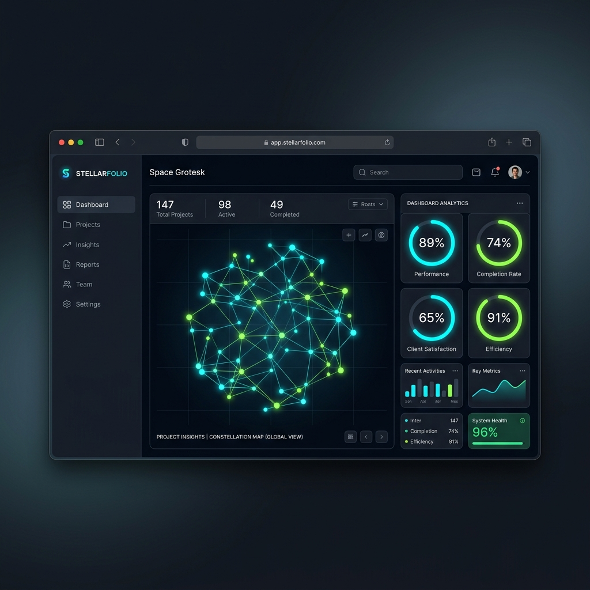

# Oracle-Primavera-P6
Aplicación ficticia y creación de plantillas en torno a trabajo de mecánica automotriz. Creación de módulo gestor de clientes para uso sencillo, stand-alone y comercializable.

